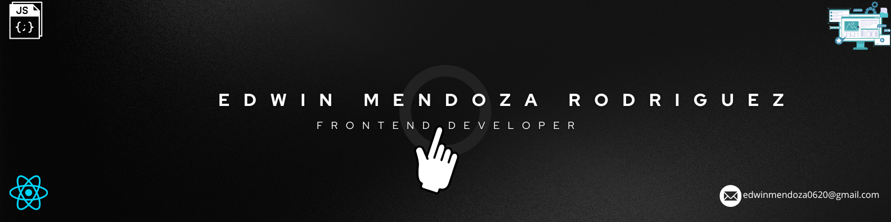
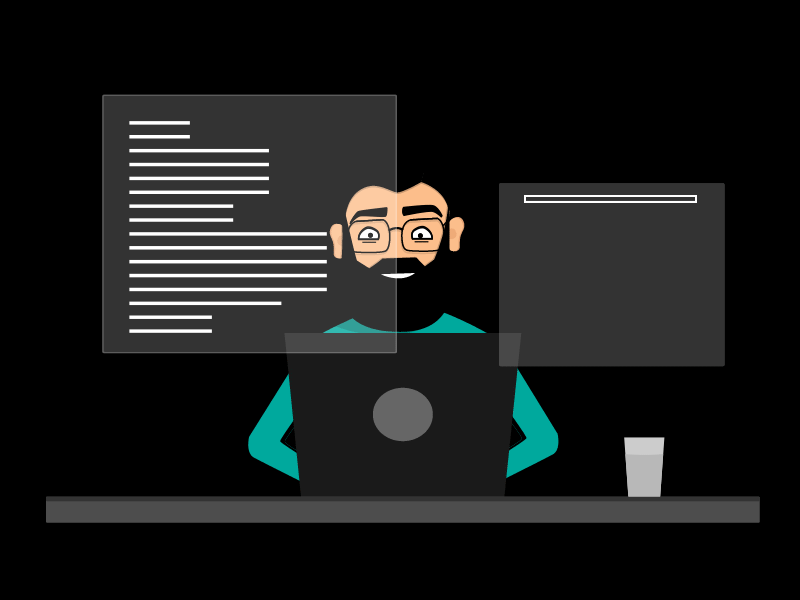

<h1 align="left">
  Hello ,
  I’m Edwin Mendoza Rodriguez - Frontend Developer 💻
</h1>

<h3>👤 About me:</h3>

👋 I’m Edwin — a Frontend Developer specialized in building secure, scalable, and user-focused web applications within banking and financial environments.

🏦 Currently, I develop interfaces that support critical financial operations, ensuring reliability, performance, and a seamless user experience across complex systems.

⚙️ My core stack includes React, JavaScript, and Tailwind CSS, focused on creating responsive, maintainable, and high-performance UIs aligned with enterprise standards.

🔐 I prioritize security, data integrity, and clean architecture, especially when working with authentication flows, role-based access, and integration with backend services.

🎯 I’m committed to writing clean, efficient code and delivering intuitive user experiences that simplify complex business processes.

🚀 Always improving, always optimizing — building software that users trust.

 

<h3 align="left">📚 Current Stack:</h3>

  
  
  
  
  
  
  

 

<h3 align="left">📖 Professional Focus:</h3>

💼 Development of enterprise frontend applications for banking systems. 
🔄 Integration with dynamic backend services. 
🔐 Implementation of secure authentication and session management. 
📊 Dynamic UI generation based on database-driven structures. 
⚡ Performance optimization and maintainable architecture. 

 

<h3 align="center">🥇 Github Stats</h3>

  

<h3>💼 Contact Me</h3>

<i>Feel free to connect with me on LinkedIn.</i>

  

