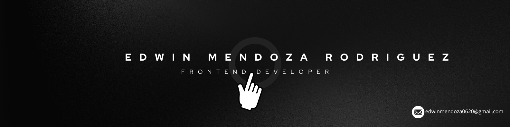

<h1 align="left"> Hi 👋🏽, I’m Edwin Mendoza Rodriguez - Junior Frontend Developer </h1>

<h3 >🍍 About me:</h3>

Hello! I'm Edwin, a passionate frontend developer and full stack enthusiast with experience in building modern, responsive web applications. My main focus is on technologies like React,Express and Tailwind CSS.

 

 
<h3 align="left">Current status:</h3>

I am currently studying modern web development. I am interested and available to collaborate on projects that involve the following technologies:

 

 †††††††††††††††††††††††††††††††† ††††††††††â€â€ †† †††††††††††††  †††††††††††††††††††††††††††††††† ††††††††††â€â€ †† †††††††††††††  †††††††††††††††††††

<h3 align="left">📖 Learning path: </h3>

As a <i>Dev</i> my passion is building innovative and efficient solutions. Currently, I am expanding my skills and knowledge by exploring key technologies in the world of computing. I am learning the following technologies:

   

   
<h3 align="left">⭐ Learning platforms: </h3>

I highly recommend this platforms if you want to learn more about programming, networking and cloud computing:

  

  

 

<h3 align="center"> ‎ ‎ ‎ ‎ ‎ Contact Info‎ ‎ ‎ ‎ ‎ ‎ ‎ ‎ ‎ ‎ ‎ ‎ ‎ ‎ ‎ ‎ ‎ ‎ ‎ ‎ ‎ ‎ ‎ ‎ ‎ ‎ ‎ ‎ ‎ ‎ ‎ ‎ ‎  ‎ ‎ ‎ ‎ ‎ ‎ ‎ ‎ ‎ ‎ ‎‎ ‎ ‎  ‎ ‎ ‎ ‎ ‎ ‎ ‎ ‎ ‎ ‎ ‎ ‎ ‎  Github Stats</h3>

<i>Feel free to connect with me in LinkedIn if you have any questions.</i>

 

 

  

